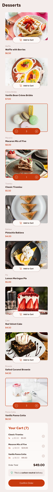

# Product list with cart solution

This is a solution to the [Product list with cart challenge on Frontend Mentor](https://www.frontendmentor.io/challenges/product-list-with-cart-5MmqLVAp_d).

## Table of contents

- [Overview](#overview)
  - [The challenge](#the-challenge)
  - [Screenshot](#screenshot)
  - [Links](#links)
- [My process](#my-process)
  - [Built with](#built-with)
- [Author](#author)

## Overview

### The challenge

Users should be able to:

- Add items to the cart and remove them
- Increase/decrease the number of items in the cart
- See an order confirmation modal when they click "Confirm Order"
- Reset their selections when they click "Start New Order"
- View the optimal layout for the interface depending on their device's screen size
- See hover and focus states for all interactive elements on the page

### Screenshot

#### Desktop

#### Mobile

### Links

- Solution URL: [Code](https://github.com/hellcsaba/product-list-cart)

## My process

### Built with

- Semantic HTML5 markup
- SCSS
- Flexbox, CSS Grid
- Desktop-first workflow
- [React](https://react.dev/) - JS library

## Author

- Website - [Csaba Hell](https://github.com/hellcsaba)
- Frontend Mentor - [@hellcsaba](https://www.frontendmentor.io/profile/hellcsaba)
- LinkedIn - [@csabahell](https://www.linkedin.com/in/csabahell/)
